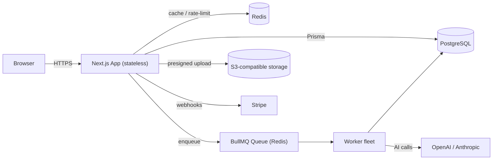
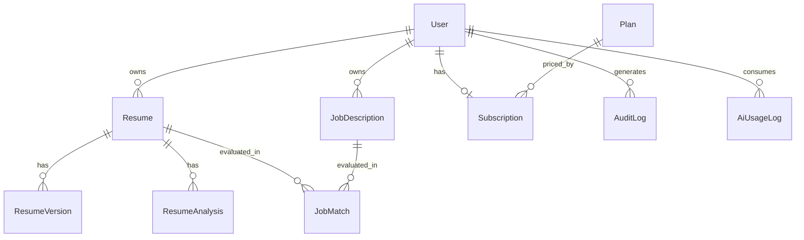

# ResumeForge AI \u2014 Architecture

## Overview

ResumeForge AI is a Next.js (App Router) SaaS that analyzes and optimizes resumes
with AI. It is designed to scale horizontally to 100k+ users by keeping the web
tier stateless and offloading heavy AI work to a background worker fleet.

## Layers

- **Web / API** \u2014 Next.js route handlers under `src/app/api/*`. Stateless; auth via
  signed JWT access cookie + persisted refresh sessions.
- **Domain libs** \u2014 `src/lib/*`: `ai` (provider abstraction + fallback), `auth`,
  `analysis`, `resume` (text extraction), `storage` (S3), `queue` (BullMQ),
  `stripe`, `rate-limit`, `prisma`, `redis`.
- **Workers** \u2014 `src/lib/queue/workers/*`, launched by `worker-runner.ts`. AI-heavy
  operations (resume analysis, job match) run here so requests stay fast.
- **Data** \u2014 PostgreSQL via Prisma. Redis for caching, rate limiting and queues.

## AI provider strategy

`src/lib/ai/index.ts` orders providers by `AI_PRIMARY_PROVIDER` and falls back to
the secondary provider on error. Every call logs token usage per user
(`AiUsageLog`) for cost analytics and admin reporting. Streaming is supported via
async iterables.

## Security

- scrypt password hashing (`src/lib/auth/password.ts`), constant-time compare.
- JWT (jose) access tokens + rotating refresh sessions.
- Optional TOTP 2FA (`otplib`).
- Redis fixed-window rate limiting on auth + AI endpoints.
- Strict security headers + CSP in `src/middleware.ts`.
- Zod validation on every request body.
- Audit logging (`AuditLog`) for sensitive actions.
- Server-side encryption on uploaded objects.

## Data model (high level)

See `prisma/schema.prisma` for the full schema, enums and indexes.

## Scaling notes

- Web tier is stateless \u2192 run N replicas behind a load balancer.
- Workers scale independently of the web tier based on queue depth.
- PostgreSQL with read replicas + PgBouncer for connection pooling.
- Redis cluster for cache + queue throughput.
- Object storage offloads large file payloads from the app tier.
